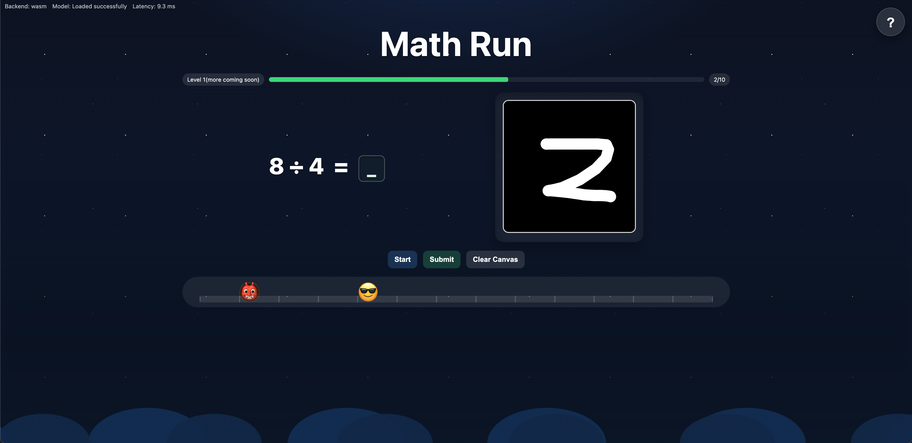
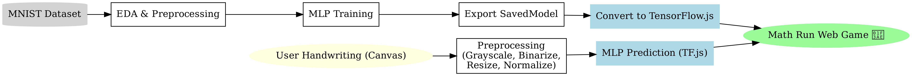
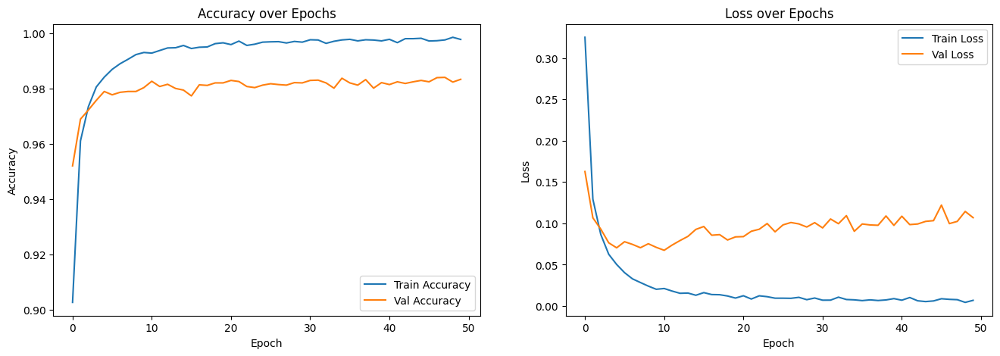
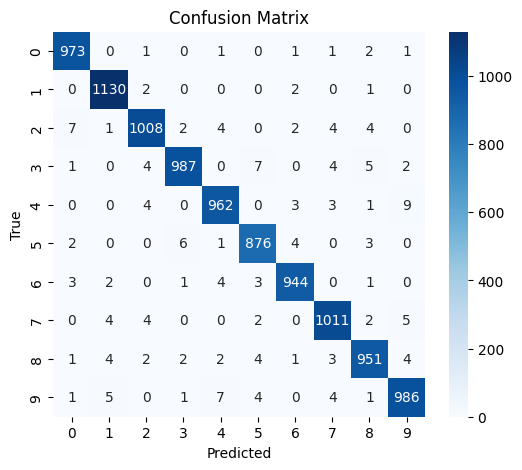
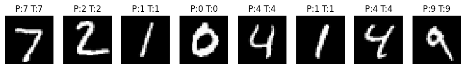

# Math Run!

<div align="center">
  
</div>

Have you ever tried playing [**Temple Run**](https://play.google.com/store/apps/details?id=com.imangi.templerun&hl=en_CA&pli=1) before? Now imagine the same thrill, but with math!

Welcome to **Math Run** — a fun browser game where you play as a cool runner 😎 escaping from a chasing monster 👹 by solving quick math problems. Every correct answer pushes you forward, while wrong or late answers let the monster catch up!  

> [**Play the Game Here**](https://alextianyf.github.io/Math-Run/)

But here’s the twist: instead of typing answers, you **handwrite digits (0–9) directly on the canvas**. Behind the scenes, a deep learning model trained with **TensorFlow** is running in your browser. I used a simple **MLP (Multi-Layer Perceptron)** trained on the classic **MNIST dataset** to recognize handwritten digits. The trained model was then deployed to the web, where it runs seamlessly inside the game.

It’s not just a game — it’s an interactive demo of how a **simple neural network** can blend with web technologies to create playful, and unique project.

---

## Project Motivation

The motivation behind **Math Run** was to combine my interests in deep learning and practical application deployment into one interactive project.

By training a simple neural network on the MNIST dataset and deploying it with TensorFlow.js, I wanted to demonstrate how deep learning models can move beyond research environments and power real-time applications directly in the browser.  

This project showcases both the end-to-end deep learning workflow (data → training → deployment) and my ability to build engaging, interactive web application.

---

## Table of Contents

- [Math Run!](#math-run)
  - [Project Motivation](#project-motivation)
  - [Table of Contents](#table-of-contents)
  - [File Structure](#file-structure)
  - [Quick Start (Local Run)](#quick-start-local-run)
  - [Development Environment Setup (with Virtual Environment)](#development-environment-setup-with-virtual-environment)
    - [Recommended Configuration](#recommended-configuration)
    - [1. Creating Virtual Environment](#1-creating-virtual-environment)
    - [2. Active the Virtual Environment(On Windows, the activation command may differ)](#2-active-the-virtual-environmenton-windows-the-activation-command-may-differ)
    - [3. Select the Python Interpreter in VS Code](#3-select-the-python-interpreter-in-vs-code)
    - [4. Install `ipykernel` (Recommended Version: 6.29.5)](#4-install-ipykernel-recommended-version-6295)
    - [5. Install Project Dependencies](#5-install-project-dependencies)
  - [Tech Stack](#tech-stack)
  - [Model Pipeline Workflow](#model-pipeline-workflow)
  - [Broader Impact \& Applications](#broader-impact--applications)
  - [Model Performance](#model-performance)
    - [Classification Report](#classification-report)
    - [Training Curves](#training-curves)
    - [Confusion Matrix](#confusion-matrix)
    - [Sample Predictions](#sample-predictions)
  - [Future Improvements](#future-improvements)
  - [Acknowledgments](#acknowledgments)
  - [License](#license)

---

## File Structure

This section provides a detailed overview of the project directory structure to help you understand where key files and resources are located.

```text
.
├── .venv/                                # (Not provided) Local Python virtual environment
├── data/
│   └── MNIST.zip                         # Original MNIST dataset (for training)
├── images/                               # Screenshots and visual assets
├── js/                                   # Frontend game logic & utilities
│   ├── app.js                            # Main app entry point (load model, predictions)
│   ├── drawing.js                        # Canvas drawing & handwriting input handling
│   ├── game.js                           # Core game mechanics (runner, monster, scoring)
│   ├── help.js                           # Help / onboarding modal interactions
│   ├── processing.js                     # Preprocessing pipeline for MNIST input
│   └── utils.js                          # Utility functions (Otsu, blur, centroid, etc.)
├── mlp_training/                         # Python training scripts & experiments
│   ├── logs/                             # Training logs
│   ├── notebook.ipynb                    # Jupyter notebook (training & evaluation demo)
│   └── saved_model/                      # TensorFlow SavedModel format (before conversion)
├── mnist_tfjs_model/                     # Deployed TensorFlow.js model
│   ├── group1-shard1of1.bin              # Model weights shard
│   └── model.json                        # Model architecture and weight manifest               
├── index.html                            # Webpage entry point (game UI + scripts)
├── styles.css                            # Styling for the game UI
├── LICENSE                               # Custom license (non-commercial, MNIST open use)
├── README.md                             # Project documentation (you are here)
├── requirements.txt                      # Python dependencies (training & preprocessing)
└── .gitignore                            # Ignore virtual env, cache, model artifacts
```

---

## Quick Start (Local Run)

Follow the steps below to set up and run the project locally:

```bash
# 1. Clone the repository
git clone https://github.com/alextianyf/Math-Run.git
cd Math-Run

# 2. (Optional) Create and activate a virtual environment
python -m venv .venv
# On macOS/Linux:
source .venv/bin/activate
# On Windows (PowerShell):
.venv\Scripts\Activate.ps1

# 3. Install Python dependencies (for training / preprocessing)
pip install -r requirements.txt

# 4. Start a local HTTP server
python -m http.server 8000
```

Once the server is running, open the game in your browser at: `http://localhost:8000/` (recommended: Google Chrome)

---

## Development Environment Setup (with Virtual Environment)

The `.venv` folder (local Python virtual environment) is **not** included in this repository.  

To set up the environment, please create your own virtual environment and install the required dependencies from `requirements.txt` as follows:

> Note: These instructions are for macOS. Setup may differ slightly on Windows.

---

### Recommended Configuration

- Operating System: MacOS(Windows and Linux environment are identical)

- Recommended Python Version: 3.12.4

- Integrated Development Environment: Visual Studio Code (VS Code)

- VS Code Extension: Jupyter Notebook(it's optional)

---

### 1. Creating Virtual Environment

Open your terminal in the project root directory and run:

```bash
python3 -m venv .venv
```

> It’s common practice to name the environment .venv. Most certainly, you could rename it accordingly.

To open a terminal in VS Code, use the shortcut: Ctrl + backtick (`)

---

### 2. Active the Virtual Environment(On Windows, the activation command may differ)

Run the following command in your terminal:

```bash
source .venv/bin/activate
```

---

### 3. Select the Python Interpreter in VS Code

Step 1: Press **`Cmd + Shift + P`** to open the Command Palette  

Step 2: Search for: **`Python: Select Interpreter`**  

Step 3: Choose the one that points to `./.venv`

---

### 4. Install `ipykernel` (Recommended Version: 6.29.5)

```bash
pip install ipykernel==6.29.5
```

> To verify or check your ipykernel installation version: `pip show ipykernel`

---

### 5. Install Project Dependencies

Install all required packages from the `requirements.txt`:

```bash
pip install -r requirements.txt
```

> You can modify or create your own environment by `pip freeze > requirements.txt`  
> you can use command `pip list` to list all installed packages

---

## Tech Stack

| Layer         | Technologies |
|---------------|--------------|
| **Frontend**  | HTML, CSS, JavaScript, TensorFlow.js |
| **ML Training** | Python, TensorFlow/Keras, NumPy, Pandas |
| **Visualization** | Matplotlib, Seaborn |
| **Deployment** | GitHub Pages |

---

## Model Pipeline Workflow

The diagram below summarizes the workflow:

<div align="center">
  
</div>

The project consists of two major parts:

1. **Training Pipeline**
   - Load **MNIST dataset** (CSV from ZIP).  
   - Perform quick **EDA**: shapes, label distribution, pixel range, sample visualization.  
   - Normalize pixel values to [0,1] and **one-hot encode** labels.  
   - Split data into **train / validation / test** sets.  
   - Build a simple **MLP**:  
     - Dense(512, ReLU) + Dropout(0.2)  
     - Dense(64, ReLU)  
     - Dense(10, Softmax)  
   - Train with **tf.GradientTape** over 50 epochs, log metrics to TensorBoard.  
   - Evaluate on test set with **confusion matrix** and **classification report**.  
   - Export model as TensorFlow `SavedModel` and convert to **TensorFlow.js** for web deployment.  

2. **Inference Pipeline**
   - Capture user handwriting from the **canvas** in the browser.  
   - Apply preprocessing steps:  
     - Convert RGBA → grayscale  
     - Otsu thresholding (binarization, adaptive inversion)  
     - Extract largest connected component (digit region)  
     - Resize longest side to 20px, paste into 28×28 canvas  
     - Align digit to centroid  
     - (Optional) Gaussian blur  
     - Normalize to [0,1]  
   - Feed the 28×28 image into the deployed **MLP (TensorFlow.js)** model.  
   - Obtain digit prediction (softmax probabilities).  
   - Update game logic:  
     - Show predicted digit  
     - If correct → runner 😎 moves forward  
     - If wrong/timeout → monster 👹 catches up

---

## Broader Impact & Applications

Although **Math Run** is presented as a playful demo, the underlying concepts are highly transferable and can be applied across industries:

- **Handwriting & Character Recognition**  
  - The digit recognition pipeline can be extended to recognize letters, signatures, or symbols.  
  - Applications include document digitization, form processing, and handwriting-based authentication.  

- **Human-Computer Interaction (HCI)**  
  - The browser-based drawing pad shows how web interfaces can integrate with deep learning models in real-time.  
  - Similar pipelines can be adapted for sketch-based search engines, educational tools, or accessibility solutions.  

- **Gamification in Education & Training**  
  - Combining interactive gameplay with ML showcases how gamification can enhance learning.  
  - Similar methods could be used to teach math, language, or even industrial training scenarios.  

- **Edge & Browser-Based AI**  
  - By deploying models with TensorFlow.js, this project highlights how inference can happen entirely on-device, without backend servers.  
  - This idea is transferable to privacy-sensitive applications such as healthcare diagnostics, financial services, or personal assistants.  

In short, while **Math Run** is a simple demo, the techniques behind it—data preprocessing, model training, browser deployment, and real-time interaction—form a foundation that can be adapted to many exciting domains.

---

## Model Performance

The trained MLP model achieved high performance on the MNIST dataset:

- **Final Training Accuracy**: ~99.8%  
- **Final Validation Accuracy**: ~98.3%  
- **Test Accuracy**: **98.28%**  
- **Test Loss**: 0.0949

### Classification Report

| Digit | Precision | Recall | F1-Score | Support |
|-------|-----------|--------|----------|---------|
| 0 | 0.985 | 0.993 | 0.989 | 980 |
| 1 | 0.986 | 0.996 | 0.991 | 1135 |
| 2 | 0.983 | 0.977 | 0.980 | 1032 |
| 3 | 0.988 | 0.977 | 0.983 | 1010 |
| 4 | 0.981 | 0.980 | 0.980 | 982 |
| 5 | 0.978 | 0.982 | 0.980 | 892 |
| 6 | 0.986 | 0.985 | 0.986 | 958 |
| 7 | 0.982 | 0.984 | 0.983 | 1028 |
| 8 | 0.979 | 0.976 | 0.978 | 974 |
| 9 | 0.979 | 0.977 | 0.978 | 1009 |

- **Macro Avg**: Precision 0.983, Recall 0.983, F1-Score 0.983  
- **Weighted Avg**: Precision 0.983, Recall 0.983, F1-Score 0.983  

### Training Curves

<div align="center">
  
</div>

### Confusion Matrix

<div align="center">
  
</div>

### Sample Predictions

<div align="center">
  
</div>

The model shows consistent performance across all digit classes with minimal misclassification.

---

## Future Improvements

While **Math Run** already demonstrates how a neural network can be deployed directly in the browser, there are several areas where the project could be expanded:

1. **Responsive Web Design**  
   - Currently, the game is optimized for desktop browsers only.  
   - Future iterations can introduce responsive layouts for mobile and tablet devices, improving accessibility and playability on different platforms.  

2. **Dynamic Model Integration**  
   - The current version uses a pre-trained MLP model hosted statically via TensorFlow.js.  
   - A potential improvement is to set up a lightweight backend (e.g., Flask, FastAPI, or Node.js) that allows dynamic model training, online fine-tuning, or serving multiple models for comparison in real-time.  

3. **Extended Game Mechanics**  
   - Introduce difficulty levels (e.g., larger numbers, multiple-digit answers, timed challenges).  
   - Add gamification elements such as leaderboards or score tracking to make the experience more engaging.  

4. **Model Enhancements**  
   - Experiment with CNNs (Convolutional Neural Networks) for improved digit recognition accuracy.  
   - Explore transfer learning or quantization to deploy lighter and faster models for the web.  

---

## Acknowledgments

- The **MNIST dataset**: a classic benchmark dataset of handwritten digits, which has enabled decades of progress in computer vision research.  

- **TensorFlow.js**: for providing the tools to run deep learning models directly in the browser, making this interactive demo possible.  

- The open-source community: whose libraries, documentation, and shared knowledge make projects like this achievable.  

---

## License

This project is released under a custom license:

- The **MNIST dataset** used in this project is publicly available and free to use for research and educational purposes (Yann LeCun et al.).  
- All **code, game logic, and assets** in this repository were independently created by **Alex Tian**.  
- You are free to use, copy, or modify the code **for personal, research, or educational purposes only**.  
- **Commercial use is strictly prohibited** without prior written permission from the author.  

THE SOFTWARE IS PROVIDED "AS IS", WITHOUT WARRANTY OF ANY KIND, EXPRESS OR IMPLIED.